## Midterm: 3D Object Detection
<hr>
<br>

## Project Overview

This project demonstrates real-time 3D object detection from Lidar range images using the high performance Complex YOLO network. We transform a range image into a 3D point cloud which is then flattened to a bird's eye view 2D image. This image is fed into the pretrained Complex YOLO model for 3D object classifications.
<hr>
<br>

## Compute Lidar Point-Cloud from Range Image
<br>

1. Visualize range image channels: [objdet_pcl.py](./student/objdet_pcl.py)


These are range and intensity maps stacked together respectively.

2. Visualize the point-cloud:  [objdet_pcl.py](./student/objdet_pcl.py)
	
<table>
	<tr>
		<td>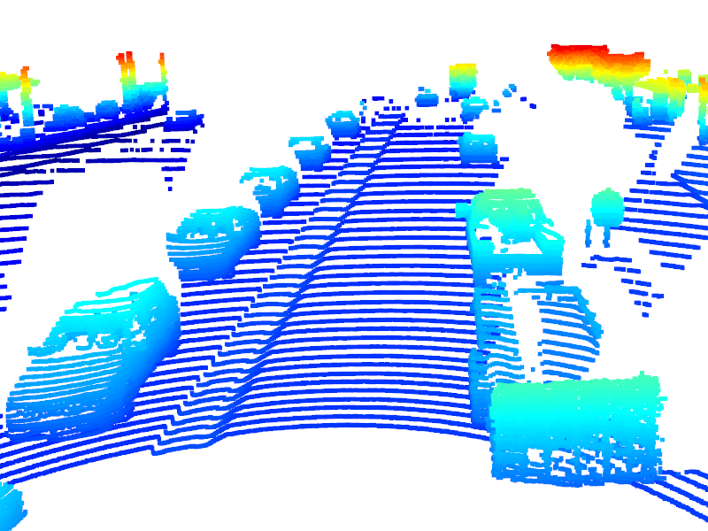</td>
		<td>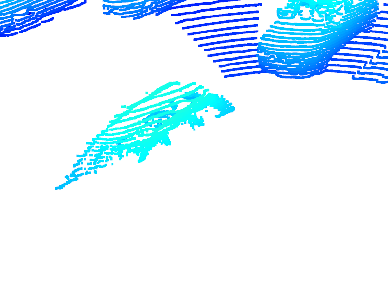</td>
	</tr>
	<tr>
		<td>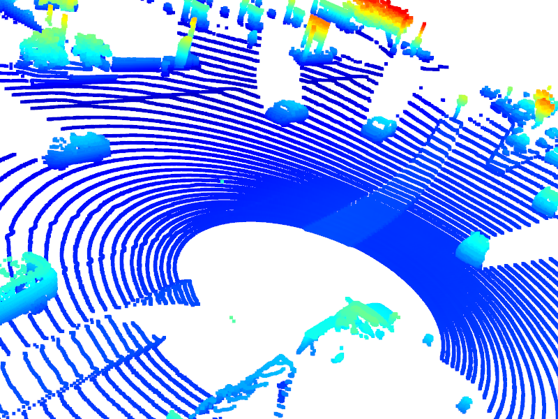</td>
		<td>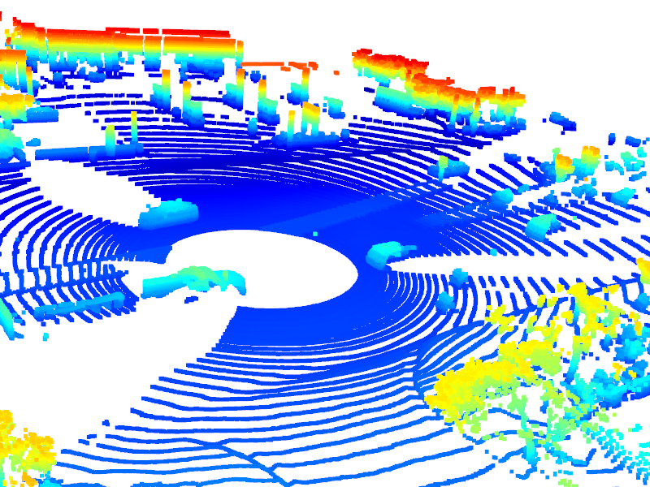</td>
	</tr>
	<tr>
		<td>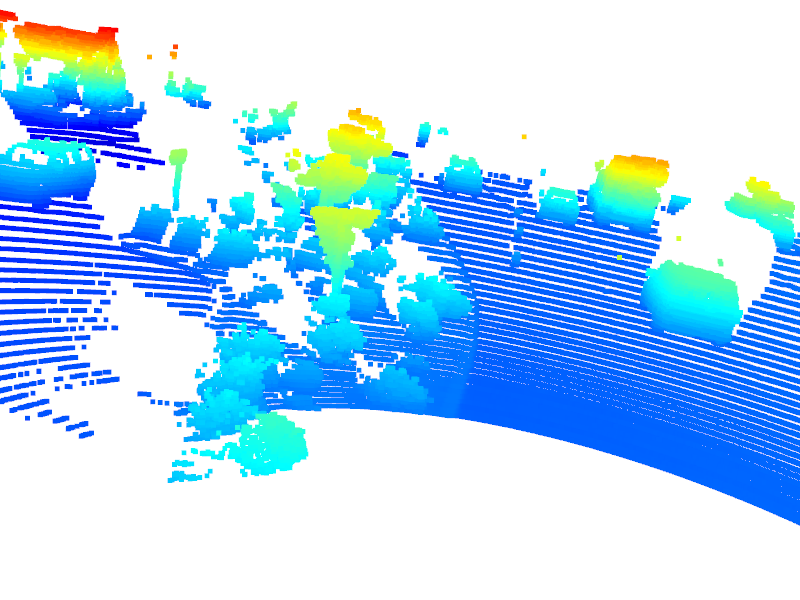</td>
		<td>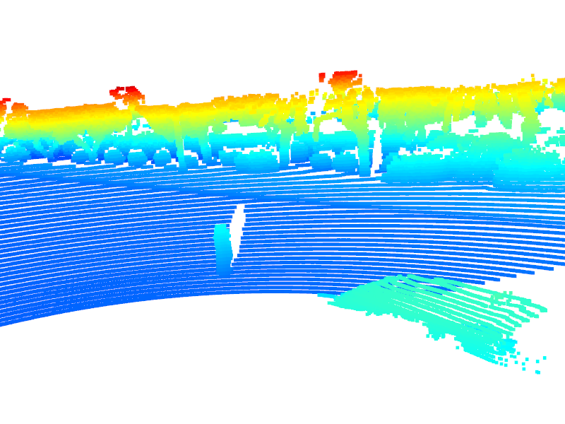</td>
	</tr>
	<tr>
		<td>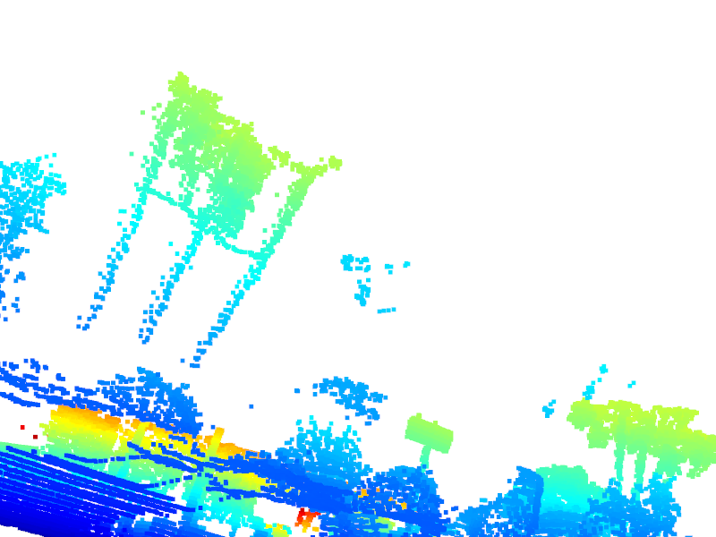</td>
		<td>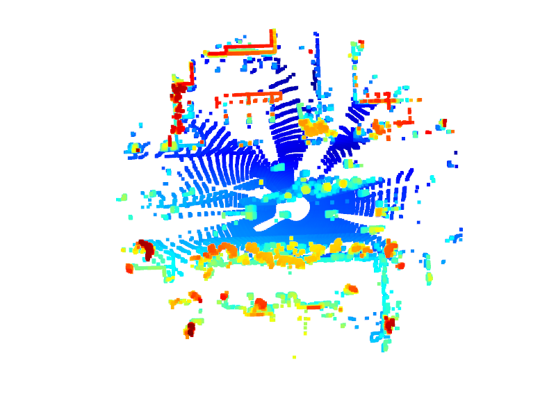</td>
	</tr>
	<tr>
		<td>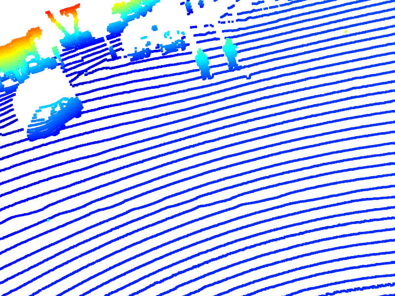</td>
		<td>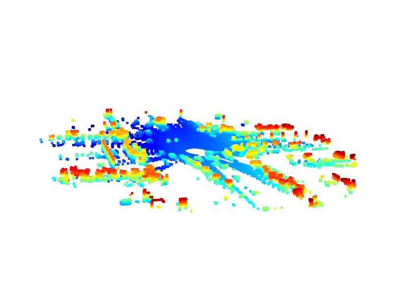</td>
	</tr>
</table>

Open3D provides a 3D-navigable visualization of the point cloud. From the inspected samples, we can readily identify vehicle features that can let us know the vehicle's orientation. Roof visibility seems reliable in our samples but there are some sparsely roofed vehicles. We can also notice blind zones of the top-mounted Lidar where it is unable to see vehicles directly on its sides. There is an instance of a pick-up truck with a trailer, some floating dots as large as rocks, outlines of pedestrians, and a confusing visual noise of shrubberies.
<hr>
<br>

## Create Birds-Eye View from Lidar PCL
<br>

1. Convert sensor coordinates to bev-map coordinates: [objdet_pcl.py](./student/objdet_pcl.py)
	
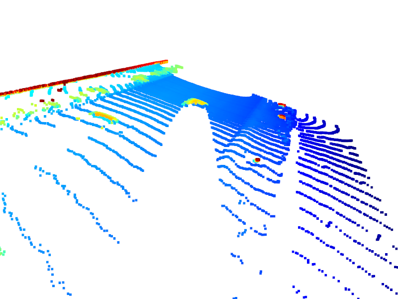

A 3D point cloud is flattened for the Complex YOLO network.

2. Compute intensity layer of bev-map: [objdet_pcl.py](./student/objdet_pcl.py)
	


We normalize the intensity values to the difference of the 99th percentile and 1st percentile to make the prominent objects (vehicles) more visible.

3. Compute height layer of bev-map (ID_S2_EX3)
	
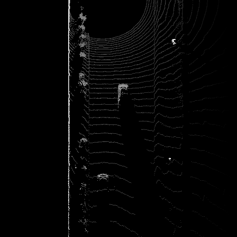

To compute the height map, we perform a lexsort to keep the max height value on the same (x, y) point.
<hr>
<br>

## Model-based Object Detection in BEV Image
<br>

1. Add a second model from a GitHub repo: [objdet_detect.py](./student/objdet_detect.py)

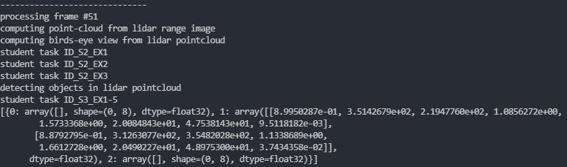
	
We experiment with a different pretrained model called SFA3D which is configured differently than Darknet. It also returns a different `detections` object.

2. Extract 3D bounding boxes from model response: [objdet_detect.py](./student/objdet_detect.py)
	
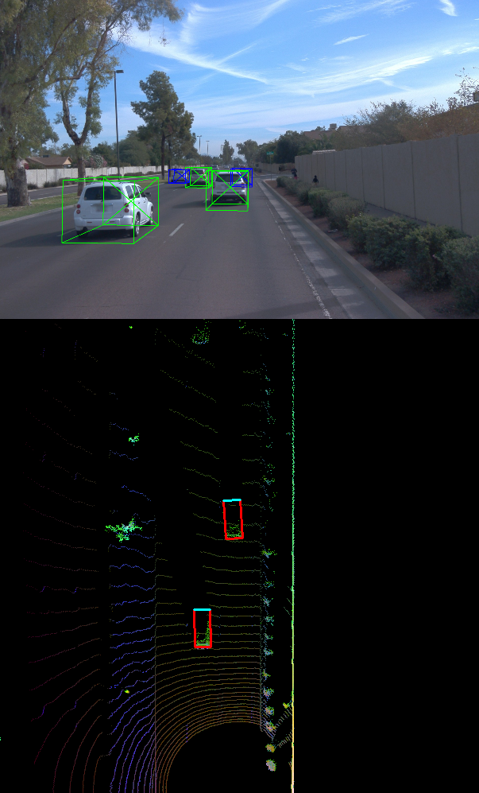

Once we get a detections object from our model we can overlay the bounding boxes.
<hr>
<br>

## Performance Evaluation for Object Detection
<br>

1. Compute intersection-over-union (IOU) between labels and detections: [objdet_detect_eval.py](./student/objdet_eval.py)
	
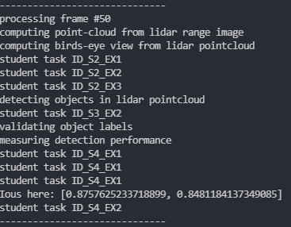

We get the IOU between label and detection areas and only accept a detection that exceeds a threshold. Here is the `ious` object after two IOU computations in one image.

2. Compute false-negatives and false-positives: [objdet_detect_eval.py](./student/objdet_eval.py)

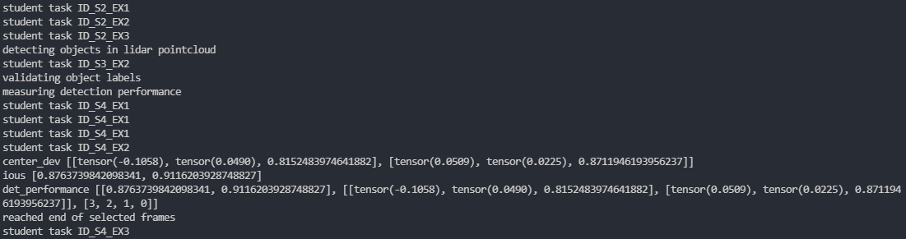

The `center_devs` object stores the 3D distance between centers of a label and detection, together with their IOU.

Also above is the `det_performance` object which is defined as follows:

```sh
pos_negs = [all_positives, true_positives, false_negatives, false_positives]
det_performance = [ious, center_devs, pos_negs]
```

False negatives and false-positives are tallied and stored in a `det_performance` per one frame.

3. Compute precision and recall: [objdet_detect_eval.py](./student/objdet_eval.py)

For 100 test frames, our Complex YOLO model detects with 99.2% precision and 84.9% recall:


The ground truth model performs as expected:

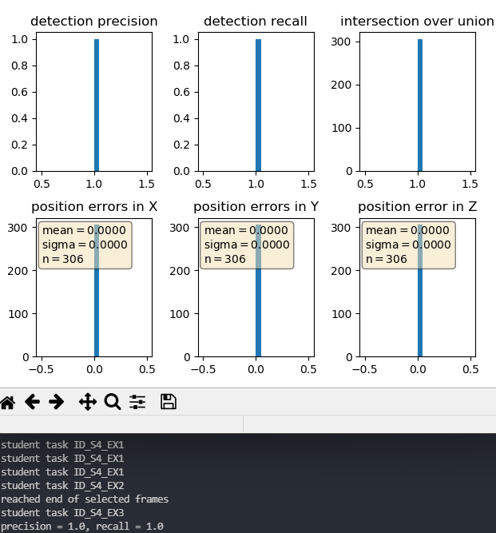