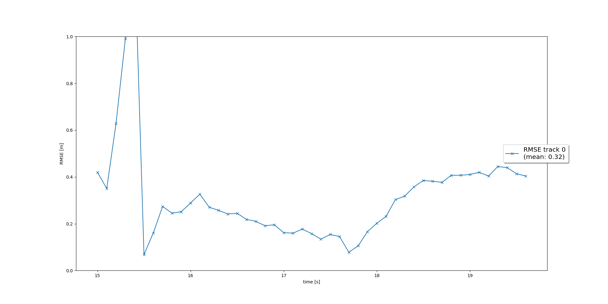
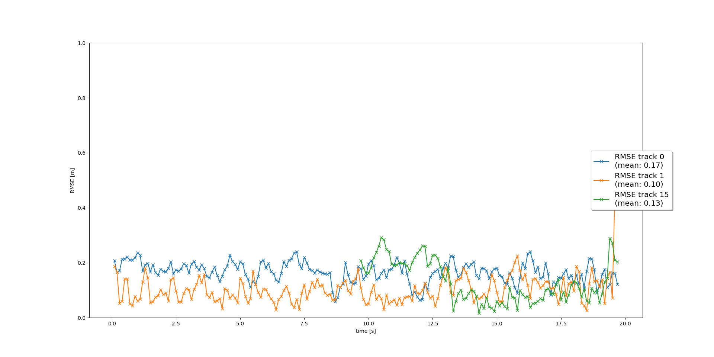

# Final: Sensor Fusion and Object Tracking

 

# Project Overview

This project demonstrates multiple 3D object tracking using an Extended Kalman filter and the Simple Nearest Neighbor (SNN) algorithm. Data association by SNN relies on the Mahalanobis distance, which weighs a distance between track and measurement with their residual covariance to prevent unlikely associations. We further manage tracks by using a track score and track state to determine which track is initialized or deleted. We then use the same Extended Kalman filter to fuse inputs from both the Lidar and camera together and evaluate tracking performance by Root Mean Square Error (RMSE).

 

# Tracking

 

## Track objects over time with a Kalman Filter

Step 1: filter.py [filter.py](./student/filter.py)

We design our Extended Kalman Filter by first defining the system matrix F for constant velocity and the corresponding process noise covariance Q. For this step we test our filter for a single target:

The resulting mean RMSE is less than 0.35 as required.

 

# Track Management

 

## Initialize, update and delete tracks

Step 2: trackmanagement.py [trackmanagement.py](./student/trackmanagement.py)

For track management, we assign a score and a state for each track. For every detection, we increase the track score while it is associated with a measurement, and decrease it otherwise. We use score thresholds to determine which track to keep and which to delete.

We see a continuous tracking for one single track.

 

#Data Association

 

##Associate measurements to tracks with nearest neighbor association

Step 3: association.py [association.py](./student/association.py)

We choose the Simple Nearest Neighbor (SNN) algorithm for data association. To minimize the case where SNN pairs the nearest measurement despite it being outside the track's covariance, we instead measure the Mahalanobis distance (MHD) which weighs the distance with the residual covariance, thus preventing unlikely associations. Since SNN is very costly, we use gating to replace unlikely measurements with an infinity distance in the association matrix to ignore them.

Here we see continuous tracking of at least two vehicles.

 

#Sensor Fusion

 

##SWBAT fuse measurements from lidar and camera
	
Step 4: measurements.py [measurements.py](./student/measurements.py)

For the final step, we enable the camera filter and let it fuse with Lidar measurements in the Kalman filter. For the camera, we use a nonlinear measurement matrix h(x). We only update tracks with a camera measurement if the track is visible to the camera, and we determine visibility with an angle filter within the camera FOV.

Our sensor fusion shows improvements in mean RMSE compared to using Lidar only in Step 3.

 

# Conclusion

 

### 1. Write a short recap of the four tracking steps and what you implemented there (filter, track management, association, camera fusion). Which results did you achieve? Which part of the project was most difficult for you to complete, and why?

In summary, we designed our Kalman filter and tested it for a single track, then added a track management system that assigns a score and state to a track and initialize or remove it by thresholds. We determine which tracks are paired to a measurement with an association matrix that uses the Simple Nearest Neighbor algorithm, and enhance the algorithm by computing Mahalanobis distances and gating tracks to minimize unlikely associations. Finally we enable camera fusion by determining a track's visiblity to the sensor before updating it with a measurement.

Multi-object tracking was improved with the sensor fusion compared to Lidar only, and mean RMSE for each track is within specification.

I found difficulty in tweaking my sensor fusion system when I used my own Lidar detection results instead of the provided reference. While my original results had 99.4% precision and 85% recall, the sensor fusion system had trouble with continuous tracking as the deviations were too high and there are lapses in object detection. I tried to tweak my scoring system and even increase the measurement noise covariance for the sensors but had trouble getting tracking to stick. I do not know if the burden of improvement is inclined more towards the deep learning object detection part of the pipeline or if the tracking system can be loosened depending on the Lidar object detector performance.

### 2. Do you see any benefits in camera-lidar fusion compared to lidar-only tracking (in theory and in your concrete results)? 

From my results there is an improvement in mean RMSE using sensor fusion over Lidar-only. The improvement is not significant, but this is based on an ideal Lidar reference result. In theory, there are domains in which Lidar is less reliable than a camera and vice versa, so a sensor fusion system solves this.

### 3. Which challenges will a sensor fusion system face in real-life scenarios? Did you see any of these challenges in the project?

I have not tried examples with more than 5 tracked objects at once, but it is easy to see tracking confusion being more likely with increased tracks and measurements. Computational complexity also would suffer greatly (O(n^2)).

### 4. Can you think of ways to improve your tracking results in the future?

A precise and accurate object detection model is the back bone of such a tracking system. For the tracking system itself, I would use a more efficient algorithm than SNN, such as those tested in this paper: https://arxiv.org/pdf/1807.05614.pdf. Perhaps parameters for covariance and score thresholds can be optimized depending on the performance of its object detection model.